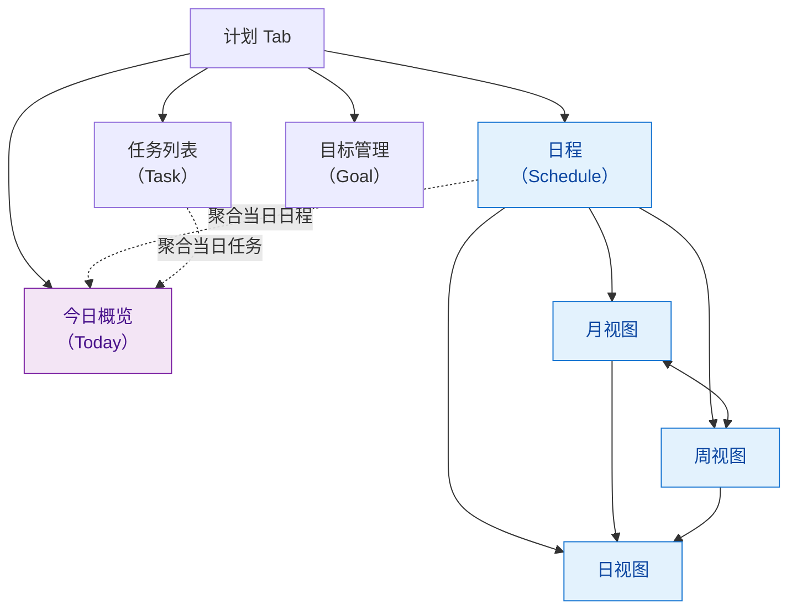
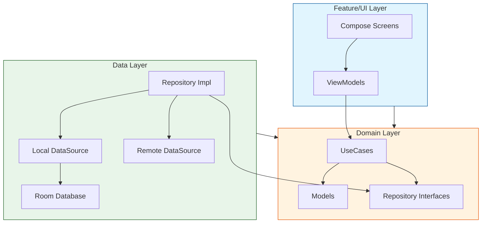
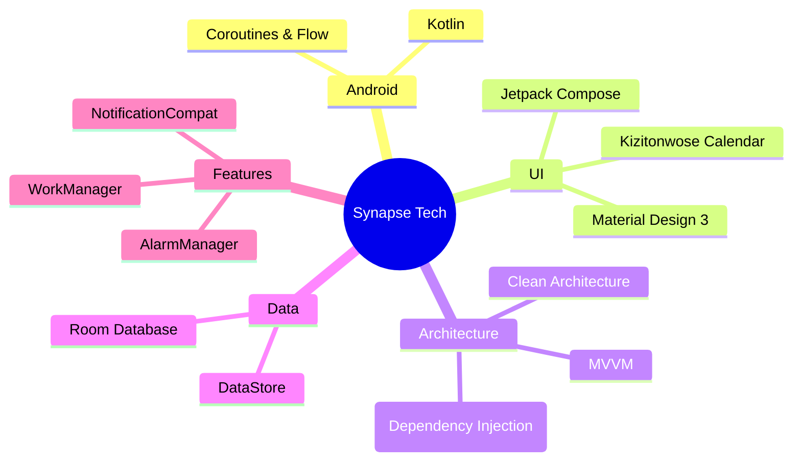
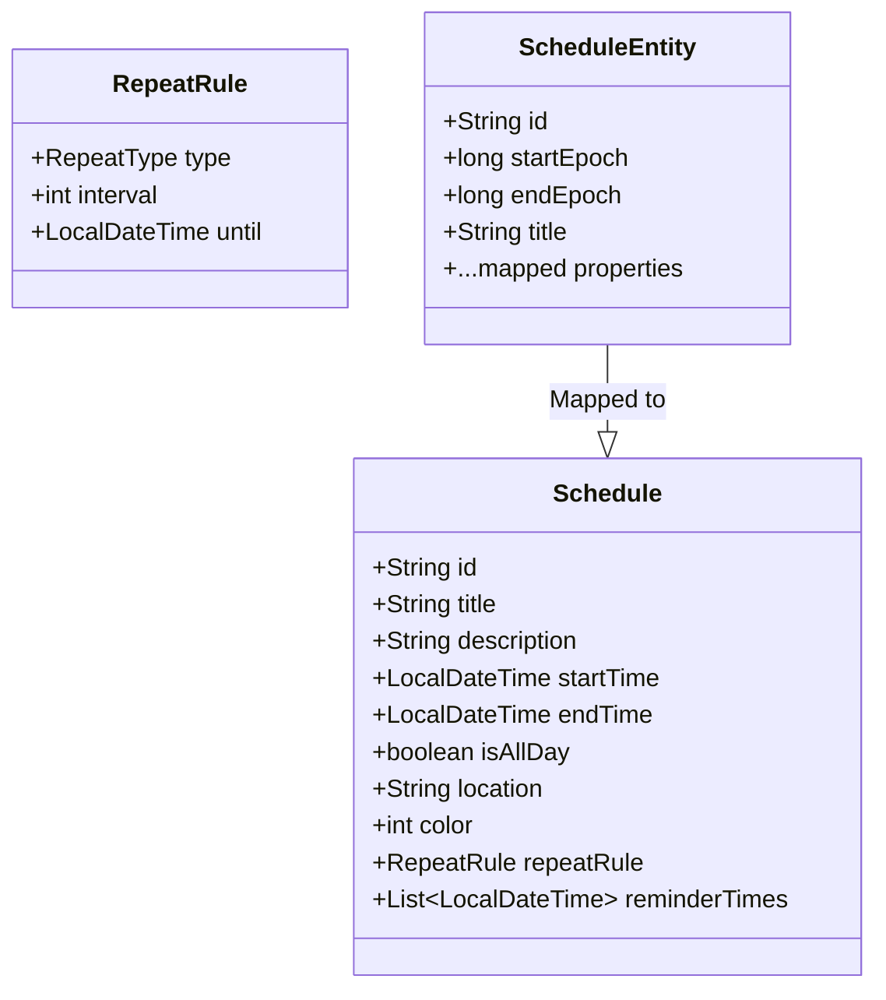
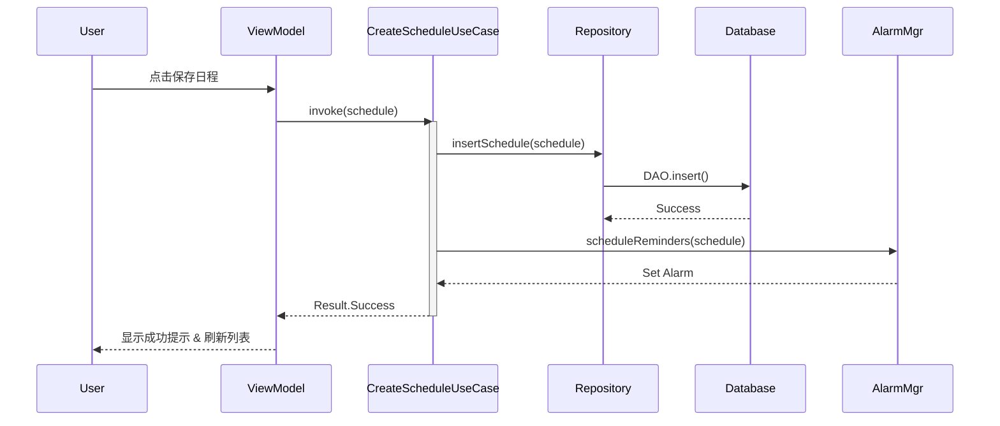

# Synapse 日历应用 你的日程管理助手 - 产品开发报告

## 前言

在快节奏的现代生活中，时间已成为最稀缺的资源。对于学生群体而言，日常不仅需要平衡课程、作业、社团与考试，还要应对频繁变动的临时安排——高效、直观且可靠的日程管理工具显得尤为关键。

然而，当前主流日历应用普遍存在两极分化：要么功能臃肿、交互复杂，学习成本高；要么过于轻量，缺乏如农历节气、多级提醒等本土化与实用性设计。更重要的是，它们大多依赖手动输入，无法理解自然语言指令，例如“下周三下午3点交高数作业”或“每天晚上8点背单词”，这与学生习惯的表达方式存在明显割裂。

为此，我们打造了 Synapse 日历——一款专为学生设计的智能日程助手。它不仅提供简洁流畅的月/周/日视图、精准保活的提醒机制和农历支持，更前瞻性地集成自然语言交互能力：用户只需用日常语言描述计划，系统即可自动解析时间、事件与重复规则，并创建结构化日程。让时间管理不再繁琐，而是像和朋友聊天一样自然、高效。

## 1. 产品功能介绍

Synapse 日历是一款基于 Android 平台的现代化日程管理应用，旨在通过简洁的界面和强大的功能帮助用户高效规划时间。目前已实现作业要求的基本功能及部分扩展功能。

### 1.1 核心功能

本项目的核心功能围绕“计划管理”展开，设计了**三大核心入口：计划 · 对话 · 用户**

### 1.1.1 计划模块

基于需求分析，**计划** 是用户日常使用的核心场景。为覆盖从即时行动到长期战略的全周期管理需求，我们将“计划”模块划分为四类前瞻性层级：**即时任务（Task）**、**中期日程（Schedule）**、**今日聚焦（Today）** 和 **长期目标（Goal）**。



#### 模块设计原则：从今日行动到长期愿景

“计划”Tab 作为用户高频交互入口，通过四个子视图构建 **“执行—安排—复盘—规划”** 的完整闭环：

##### 1. **今日概览（Today）**  
智能聚合当日所有 **日程事件**、**待完成任务** 与 **目标进度**，提供一站式行动中心。  
- 自动高亮未完成项与即将开始的日程  
- 支持快速标记完成、跳转详情或添加临时事项  
- 减少上下文切换，降低认知负荷，助力高效启动一天

##### 2. **日程（Schedule）**  
支持 **月 / 周 / 日** 三种时间粒度的无缝切换，满足不同场景下的排期需求：

- **月视图**：全局时间分布，支持 **农历显示** 与 **二十四节气标注**，贴合中文用户习惯；底部常驻所选日期的简要日程摘要。
- **周视图**：垂直时间轴布局，直观展示每日时间占用密度，便于平衡工作与生活。
- **日视图**：分钟级精度的时间块排布，适用于会议、课程等固定时段事件的精细安排。

> **交互创新**：  
> 不同于传统 Tab 切换，我们采用 **手势拖拽** 实现月 ↔ 周视图的平滑过渡；点击任意日期，自动下钻至对应 **日视图**，并定位到当前时间线，实现“所见即所控”。

**月视图示意**：
```plaintext
┌─────────────────────────────────────────┐
│  < 2025年12月 >             [+][今天]   │
├─────┬─────┬─────┬─────┬─────┬─────┬─────┤
│ 日  │ 一   │ 二  │ 三   │ 四  │ 五  │ 六  │
├─────┼─────┼─────┼─────┼─────┼─────┼─────┤
│     │  1  │  2  │  3  │  4  │  5  │  6  │
│     │初一 │     │ ●●  │     │ ●   │     │
├─────┼─────┼─────┼─────┼─────┼─────┼─────┤
│  7  │  8  │  9  │ 10  │ 11  │ 12  │ 13  │
│     │大雪 │     │     │     │     │     │
└─────┴─────┴─────┴─────┴─────┴─────┴─────┘
└────────────────[拖拽切换周视图]───────────┘
│            12月5日的日程摘要              │
│ • 10:00 团队周会                         │
│ • 15:30 客户提案                         │
└─────────────────────────────────────────┘
```

**周视图示意**：
```plaintext
┌────────────────────────────────────────────────┐
│  < 第49周（12/1–12/7）>              [+][今天]   │
├──────┬──────┬──────┬──────┬──────┬──────┬──────┤
│ 12/1 │ 12/2 │ 12/3 │ 12/4 │ 12/5 │ 12/6 │ 12/7 │
├──────┼──────┼──────┼──────┼──────┼──────┼──────┤
│08:00 │      │      │██████│      │      │      │
│09:00 │██████│      │██████│      │      │      │
│10:00 │██████│      │      │      │██████│      │
│...   │      │      │      │      │      │      │
└──────┴──────┴──────┴──────┴──────┴──────┴──────┘
```

**功能支持**：  
完整实现日程的 **CRUD 操作**，支持：
- 标题、描述、起止时间、地点  
- 全天事件标记  
- 自定义颜色分类（如工作/学习/生活）  
- 重复规则（每日/每周/自定义）

##### 3. **任务（Task）**  
聚焦 **无固定时间点** 的待办事项，强调轻量、高效的操作体验：
- 快速创建：支持语音输入、快捷模板  
- 状态管理：右滑完成，左滑删除；已完成任务可左滑归档，保持主列表清爽  
- 支持子任务拆解、优先级标记（高/中/低）  
- 与“今日概览”联动，自动聚合当日任务

> 设计理念：**减少操作路径，提升完成率**。

##### 4. **目标（Goal）**  
支持设定 **中长期目标**（如“期末GPA 3.8”、“30天背完5000单词”），并通过两种方式推动落地：
- **手动拆解**：用户可将目标分解为阶段性里程碑与具体任务  
- **AI 辅助生成**：基于目标描述，智能推荐子任务、建议时间分配，并自动关联日程或任务

> todo - 1
> 现阶段还实现未目标的拆解，这将是未来开发的一个重要功能。

### 1.1.2 AI 对话模块

AI 对话模块作为智能助理的核心交互入口，旨在通过自然语言理解（NLU）与生成（NLG）能力，将用户意图高效转化为可执行的计划动作，降低任务管理的认知门槛。故设计了一个 名为 Syna 的个人助理形象。

#### 核心能力

为了切近用户实际需求，AI 对话模块不只是一个自然语言的输入通道，更是一个智能助手，能够理解用户意图、执行指令并为用户提供及时、有价值的情绪价值。

#### 已实现功能

- **自然语言指令解析**  
  支持用户以口语化方式输入指令，如：  
  > “明天上午10点和张老师开会，地点在A305”  
  > “下周每天背50个单词，持续7天”  
  > “把‘项目终稿’截止日提前到周五”  
  系统自动识别时间、事件、重复规则、关联目标等要素，并映射为结构化日程或任务。

- **上下文感知对话**  
  基于会话历史维持短期记忆，支持多轮澄清与修正。例如：  
  > 用户：“帮我安排一次团队会议。”  
  > AI：“请问希望安排在本周还是下周？预计时长多久？”  
  > 用户：“这周三下午，2小时。”  
  > AI 自动创建日程并确认。

使用了 Golang 的 Gin 框架，构建了 RESTful API 接口，接入 Qwen 3.5 大模型，实现了自然语言理解与生成，构建 Function Calling 机制，将ai与用户本地数据库进行交互，实现了任务管理的自动化。

#### 后续的规划与选型

为了更好地满足用户需求，我也为未来需要实现的功能做出了以下规划：

- **主动建议与提醒**  
  结合用户日程密度、任务截止时间及目标进度，AI 可主动推送建议：  
  - “您有3项任务临近截止，是否需要重新安排时间？”  
  - “检测到明日空闲较多，是否将‘健身计划’移至明天？”

- **长期记忆与情感建模**  
  利用大模型的上下文理解能力，对用户情感状态进行建模，为后续决策提供情感支持。我希望在未来的版本中，能够实现对用户情感的实时监测与分析，从而更好地理解用户需求，提供更个性化的服务。
  - 端侧微模型 提供快速的意图解析，减少因网络延迟导致的响应延迟，提升用户体验。
  - 用户偏好维度建模，基于用户历史交互数据，建立高纬度向量存储在 postgres 数据库中，并将嵌入向量用于后续的个性化交互。
  - 长期记忆与文档管理，利用大模型的上下文理解能力，对用户的文档进行摘要与分类，为后续的查询与推荐提供支持。

> **定位**：AI 对话不是炫技，而是“隐形助手”——在用户需要时精准响应，在不需要时保持静默。

### 1.1.3 用户管理模块

用户管理模块负责身份认证、数据隔离与个性化配置，是保障多端同步与隐私安全的基础设施。

#### 功能组成

- **auth 服务登录与账户体系**  
  使用邮箱验证码与图片验证码双因素认证，密码采用 bcrypt 加密存储，确保用户账户安全。
  并使用双token机制，分别为access token与refresh token，access token用于接口调用，refresh token用于刷新access token，确保无状态登录，同时也提高了账户安全性。

- **本地 WAL Sqlite 存储**  
  - **离线优先**：所有操作默认在本地 SQLite 数据库完成，确保无网络时仍可流畅使用；

- **网络日历的导入与导出,日历订阅**  
  支持用户从网络导入日程，实现跨设备同步。  
  - 用户也可以将本地计划导出为 ICS 格式，方便在其他日历应用中导入。
  - 用户也可以订阅网络上的日历，如学校课表、节假日日历等，实现与他人计划的同步。


> **设计原则**：**简单注册，自由退出，数据主权归用户所有**。不强制绑定，不收集非必要信息，让用户真正掌控自己的数字生活。

### 1.2 扩展功能

为提升文化适配性、生态兼容性与用户体验温度，计划模块将逐步集成以下扩展能力：

- **中国农历与节气支持**  
  集成开源 `Lunar` 算法库，在月视图及“今日概览”页面同步显示农历日期、传统节日与二十四节气（如“大雪”“立春”），深度契合中文用户的时序认知与生活节奏。

- **AI 辅助日程生成**  
  基于用户输入的目标或自然语言指令（如“下周每天背50个单词”），由 AI 模型自动拆解并生成结构化日程或任务，智能分配至空闲时段，实现从意图到执行的无缝转化。  

- **Bing 每日一图**  
  在“今日概览”顶部引入 **Bing 每日高清壁纸**。
  将效率工具注入人文温度，让每一天的开始更具仪式感与正向反馈。

- **日历数据导入与订阅架构**  
  - 数据库实现`Subscription` 表，用于管理 WebCal/ICS 订阅源（如学校课表、节假日日历）；  
  - 引入 `biweekly` 库解析 iCalendar 协议，为后续接入 Google Calendar、Outlook 等主流日历服务奠定技术基础；  


> 通过 **文化适配 + 智能增强 + 视觉激励 + 生态开放** 四维扩展，让计划工具不仅“好用”，更“懂你”。

## 2. 软件架构设计

本项目采用 **Clean Architecture (整洁架构)** 结合 **MVVM** 模式，确保高内聚、低耦合，易于测试和扩展。

### 2.1 架构分层图



### 2.2 技术栈概览



---

## 3. 程序概要设计

### 3.1 核心数据模型 (ER图)

日程数据模型设计兼顾了灵活性与扩展性，支持复杂的重复规则。



### 3.2 业务流程：日程创建



---

## 4. 技术亮点与实现原理

### 4.1 强力保活提醒机制 (Reliable Reminders)

针对 Android 系统严格的后台限制，本项目实现了一套高可靠的提醒方案：

- **精确闹钟 (`setAlarmClock`)**：使用最高优先级的闹钟 API，确保在 Doze (打盹) 模式下也能唤醒 CPU。
- **前台服务守护 (`ReminderGuardService`)**：在提醒触发的一段时间前启动前台服务，提升进程优先级，防止被系统杀后台，从而保证闹钟准时执行。

### 4.2 现代化的 UI/UX 体验

- **Shared Element Transitions**：在从“月视图”点击进入“日详情”时，使用了 Compose 实验性的共享元素转场，提供丝滑的视觉连续性。
- **单向数据流 (UDF)**：UI 状态严格由 ViewModel 的 `StateFlow` 驱动，因果关系清晰，极大降低了 UI 状态同步的 bug 率。

### 4.3 严格的模块隔离

- **Domain 纯净性**：`Domain` 模块仅包含纯 Kotlin 代码，不依赖 Android SDK，这使得核心业务逻辑可以脱离 Android 模拟器进行快速单元测试 (Unit Test)。
