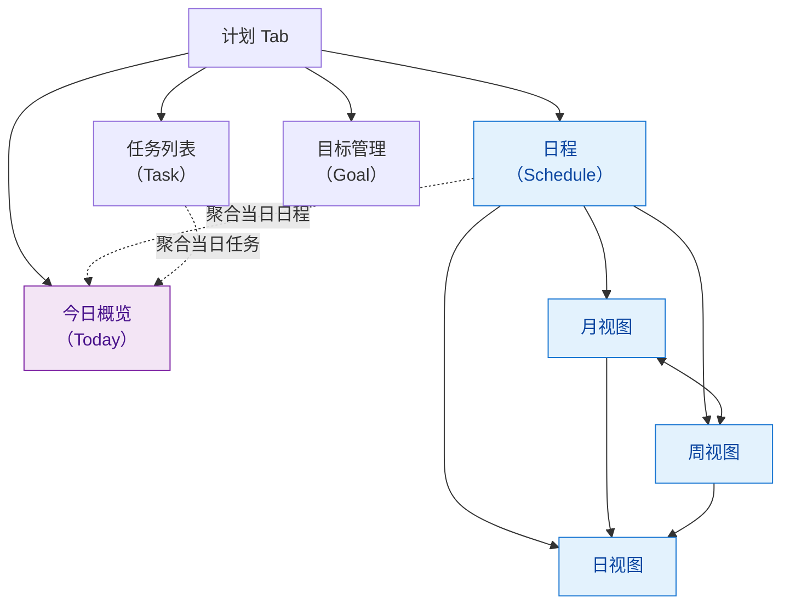
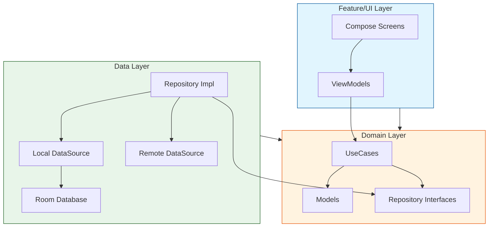
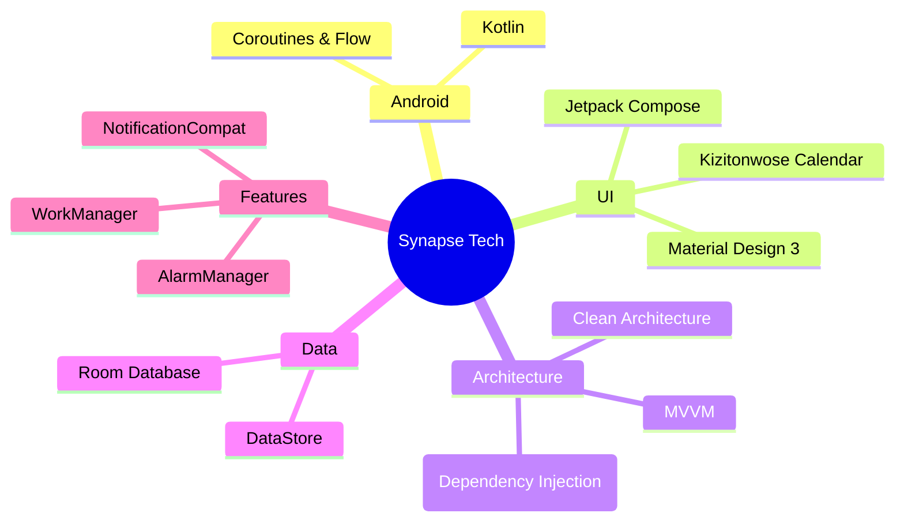
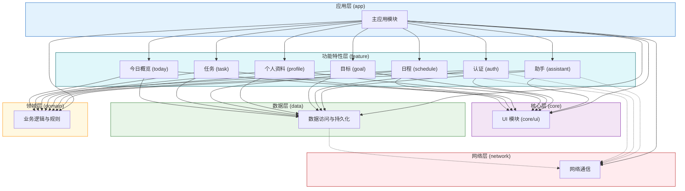
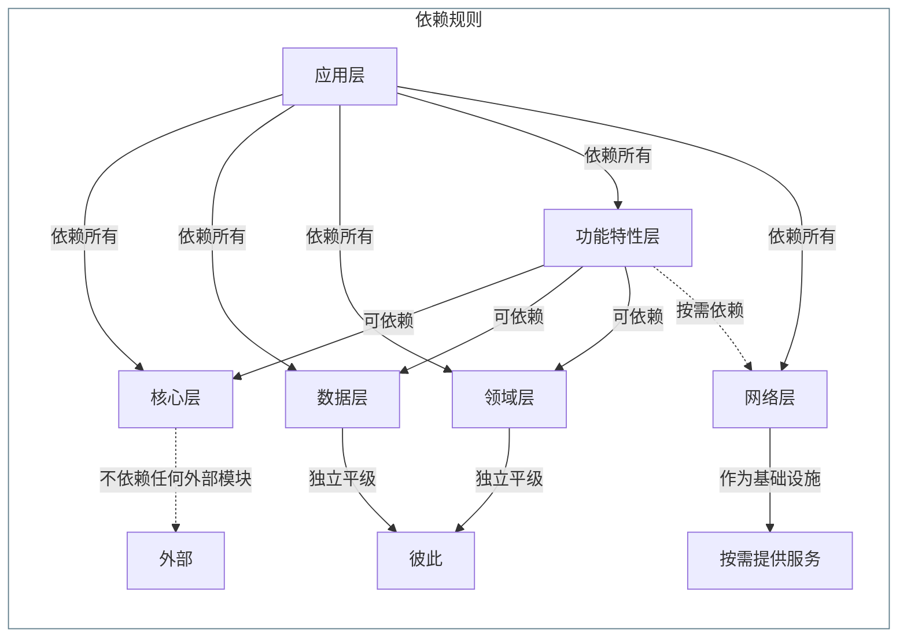
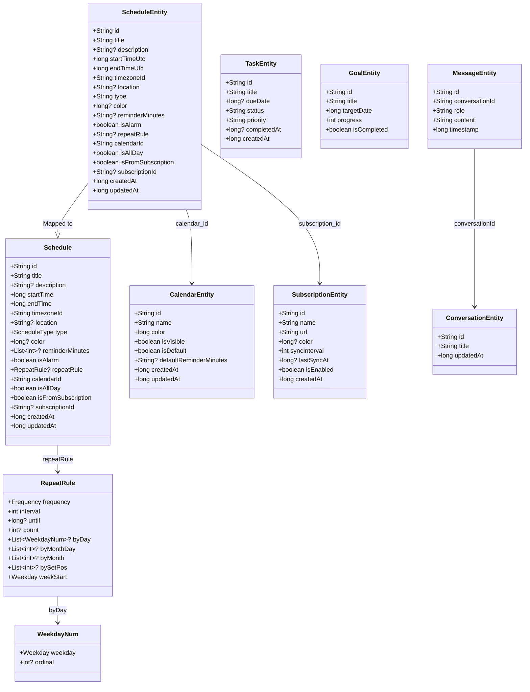
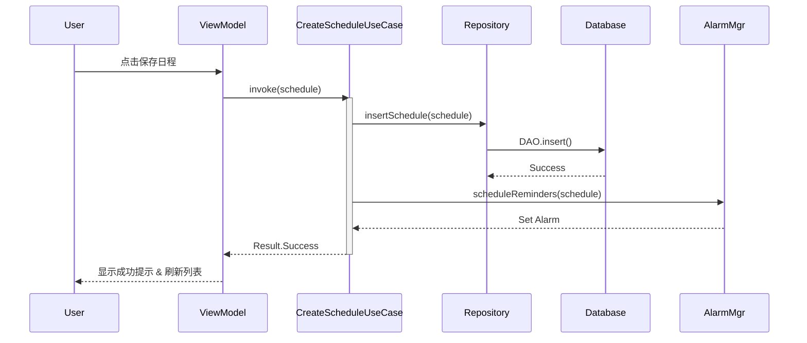
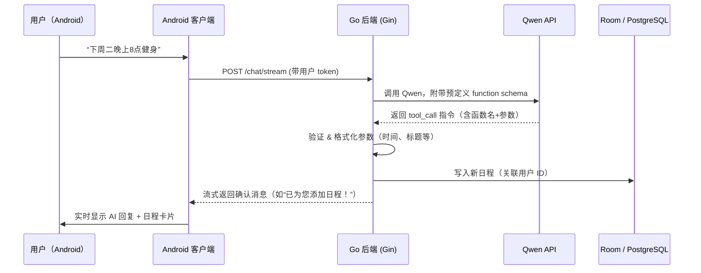

# Synapse 日历应用

## 你的日程管理助手 - 产品开发报告

## 前言

在快节奏的现代生活中，时间已成为最稀缺的资源。对于学生群体而言，日常不仅需要平衡课程、作业、社团与考试，还要应对频繁变动的临时安排——高效、直观且可靠的日程管理工具显得尤为关键。

然而，当前主流日历应用普遍存在两极分化：要么功能臃肿、交互复杂，学习成本高；要么过于轻量，缺乏如农历节气、多级提醒等本土化与实用性设计。更重要的是，它们大多依赖手动输入，无法理解自然语言指令，例如“下周三下午3点交高数作业”或“每天晚上8点背单词”，这与学生习惯的表达方式存在明显割裂。

为此，我们打造了 Synapse 日历——一款专为学生设计的智能日程助手。它不仅提供简洁流畅的月/周/日视图、精准保活的提醒机制和农历支持，更前瞻性地集成自然语言交互能力：用户只需用日常语言描述计划，系统即可自动解析时间、事件与重复规则，并创建结构化日程。让时间管理不再繁琐，而是像和朋友聊天一样自然、高效。

## 1. 产品功能介绍

Synapse 日历是一款基于 Android 平台的现代化日程管理应用，旨在通过简洁的界面和强大的功能帮助用户高效规划时间。目前已实现作业要求的基本功能及部分扩展功能。

### 1.1 核心功能

本项目的核心功能围绕“计划管理”展开，设计了**三大核心入口：计划 · 对话 · 用户**

### 1.1.1 计划模块

基于需求分析，**计划** 是用户日常使用的核心场景。为覆盖从即时行动到长期战略的全周期管理需求，我们将“计划”模块划分为四类前瞻性层级：**即时任务（Task）**、**中期日程（Schedule）**、**今日聚焦（Today）** 和 **长期目标（Goal）**。



#### 模块设计原则：从今日行动到长期愿景

“计划”Tab 作为用户高频交互入口，通过四个子视图构建 **“执行—安排—复盘—规划”** 的完整闭环：

##### 1. **今日概览（Today）**  

智能聚合当日所有 **日程事件**、**待完成任务** 与 **目标进度**，提供一站式行动中心。  

- 自动高亮未完成项与即将开始的日程  
- 支持快速标记完成、跳转详情或添加临时事项  
- 减少上下文切换，降低认知负荷，助力高效启动一天

##### 2. **日程（Schedule）**  

支持 **月 / 周 / 日** 三种时间粒度的无缝切换，满足不同场景下的排期需求：

- **月视图**：全局时间分布，支持 **农历显示** 与 **二十四节气标注**，贴合中文用户习惯；底部常驻所选日期的简要日程摘要。
- **周视图**：垂直时间轴布局，直观展示每日时间占用密度，便于平衡工作与生活。
- **日视图**：分钟级精度的时间块排布，适用于会议、课程等固定时段事件的精细安排。

> **交互创新**：  
> 不同于传统 Tab 切换，我们采用 **手势拖拽** 实现月 ↔ 周视图的平滑过渡；点击任意日期，自动下钻至对应 **日视图**，并定位到当前时间线，实现“所见即所控”。

**月视图示意**：

```plaintext
┌─────────────────────────────────────────┐
│  < 2025年12月 >             [+][今天]   │
├─────┬─────┬─────┬─────┬─────┬─────┬─────┤
│ 日  │ 一   │ 二  │ 三   │ 四  │ 五  │ 六  │
├─────┼─────┼─────┼─────┼─────┼─────┼─────┤
│     │  1  │  2  │  3  │  4  │  5  │  6  │
│     │初一 │     │ ●●  │     │ ●   │     │
├─────┼─────┼─────┼─────┼─────┼─────┼─────┤
│  7  │  8  │  9  │ 10  │ 11  │ 12  │ 13  │
│     │大雪 │     │     │     │     │     │
└─────┴─────┴─────┴─────┴─────┴─────┴─────┘
└────────────────[拖拽切换周视图]───────────┘
│            12月5日的日程摘要              │
│ • 10:00 团队周会                         │
│ • 15:30 客户提案                         │
└─────────────────────────────────────────┘
```

**周视图示意**：

```plaintext
┌────────────────────────────────────────────────┐
│  < 第49周（12/1–12/7）>              [+][今天]   │
├──────┬──────┬──────┬──────┬──────┬──────┬──────┤
│ 12/1 │ 12/2 │ 12/3 │ 12/4 │ 12/5 │ 12/6 │ 12/7 │
├──────┼──────┼──────┼──────┼──────┼──────┼──────┤
│08:00 │      │      │██████│      │      │      │
│09:00 │██████│      │██████│      │      │      │
│10:00 │██████│      │      │      │██████│      │
│...   │      │      │      │      │      │      │
└──────┴──────┴──────┴──────┴──────┴──────┴──────┘
```

**功能支持**：  
完整实现日程的 **CRUD 操作**，支持：

- 标题、描述、起止时间、地点  
- 全天事件标记  
- 自定义颜色分类（如工作/学习/生活）  
- 重复规则（每日/每周/自定义）

##### 3. **任务（Task）**  

聚焦 **无固定时间点** 的待办事项，强调轻量、高效的操作体验：

- 快速创建：支持语音输入、快捷模板  
- 状态管理：右滑完成，左滑删除；已完成任务可左滑归档，保持主列表清爽  
- 支持子任务拆解、优先级标记（高/中/低）  
- 与“今日概览”联动，自动聚合当日任务

> 设计理念：**减少操作路径，提升完成率**。

##### 4. **目标（Goal）**  

支持设定 **中长期目标**（如“期末GPA 3.8”、“30天背完5000单词”），并通过两种方式推动落地：

- **手动拆解**：用户可将目标分解为阶段性里程碑与具体任务  
- **AI 辅助生成**：基于目标描述，智能推荐子任务、建议时间分配，并自动关联日程或任务

> todo - 1
> 现阶段还实现未目标的拆解，这将是未来开发的一个重要功能。

### 1.1.2 AI 对话模块

AI 对话模块作为智能助理的核心交互入口，旨在通过自然语言理解（NLU）与生成（NLG）能力，将用户意图高效转化为可执行的计划动作，降低任务管理的认知门槛。故设计了一个 名为 Syna 的个人助理形象。

#### 核心能力

为了切近用户实际需求，AI 对话模块不只是一个自然语言的输入通道，更是一个智能助手，能够理解用户意图、执行指令并为用户提供及时、有价值的情绪价值。

#### 已实现功能

- **自然语言指令解析**  
  支持用户以口语化方式输入指令，如：  
  > “明天上午10点和张老师开会，地点在A305”  
  > “下周每天背50个单词，持续7天”  
  > “把‘项目终稿’截止日提前到周五”  
  系统自动识别时间、事件、重复规则、关联目标等要素，并映射为结构化日程或任务。

- **上下文感知对话**  
  基于会话历史维持短期记忆，支持多轮澄清与修正。例如：  
  > 用户：“帮我安排一次团队会议。”  
  > AI：“请问希望安排在本周还是下周？预计时长多久？”  
  > 用户：“这周三下午，2小时。”  
  > AI 自动创建日程并确认。

使用了 Golang 的 Gin 框架，构建了 RESTful API 接口，接入 Qwen 3.5 大模型，实现了自然语言理解与生成，构建 Function Calling 机制，将ai与用户本地数据库进行交互，实现了任务管理的自动化。

#### 后续的规划与选型

为了更好地满足用户需求，我也为未来需要实现的功能做出了以下规划：

- **主动建议与提醒**  
  结合用户日程密度、任务截止时间及目标进度，AI 可主动推送建议：  
  - “您有3项任务临近截止，是否需要重新安排时间？”  
  - “检测到明日空闲较多，是否将‘健身计划’移至明天？”

- **长期记忆与情感建模**  
  利用大模型的上下文理解能力，对用户情感状态进行建模，为后续决策提供情感支持。我希望在未来的版本中，能够实现对用户情感的实时监测与分析，从而更好地理解用户需求，提供更个性化的服务。
  - 端侧微模型 提供快速的意图解析，减少因网络延迟导致的响应延迟，提升用户体验。
  - 用户偏好维度建模，基于用户历史交互数据，建立高纬度向量存储在 postgres 数据库中，并将嵌入向量用于后续的个性化交互。
  - 长期记忆与文档管理，利用大模型的上下文理解能力，对用户的文档进行摘要与分类，为后续的查询与推荐提供支持。

> **定位**：AI 对话不是炫技，而是“隐形助手”——在用户需要时精准响应，在不需要时保持静默。

### 1.1.3 用户管理模块

用户管理模块负责身份认证、数据隔离与个性化配置，是保障多端同步与隐私安全的基础设施。

#### 功能组成

- **auth 服务登录与账户体系**  
  使用邮箱验证码与图片验证码双因素认证，密码采用 bcrypt 加密存储，确保用户账户安全。
  并使用双token机制，分别为access token与refresh token，access token用于接口调用，refresh token用于刷新access token，确保无状态登录，同时也提高了账户安全性。

- **本地 WAL Sqlite 存储**  
  - **离线优先**：所有操作默认在本地 SQLite 数据库完成，确保无网络时仍可流畅使用；

- **网络日历的导入与导出,日历订阅**  
  支持用户从网络导入日程，实现跨设备同步。  
  - 用户也可以将本地计划导出为 ICS 格式，方便在其他日历应用中导入。
  - 用户也可以订阅网络上的日历，如学校课表、节假日日历等，实现与他人计划的同步。

> **设计原则**：**简单注册，自由退出，数据主权归用户所有**。不强制绑定，不收集非必要信息，让用户真正掌控自己的数字生活。

### 1.2 扩展功能

为提升文化适配性、生态兼容性与用户体验温度，计划模块将逐步集成以下扩展能力：

- **中国农历与节气支持**  
  集成开源 `Lunar` 算法库，在月视图及“今日概览”页面同步显示农历日期、传统节日与二十四节气（如“大雪”“立春”），深度契合中文用户的时序认知与生活节奏。

- **AI 辅助日程生成**  
  基于用户输入的目标或自然语言指令（如“下周每天背50个单词”），由 AI 模型自动拆解并生成结构化日程或任务，智能分配至空闲时段，实现从意图到执行的无缝转化。  

- **Bing 每日一图**  
  在“今日概览”顶部引入 **Bing 每日高清壁纸**。
  将效率工具注入人文温度，让每一天的开始更具仪式感与正向反馈。

- **日历数据导入与订阅架构**  
  - 数据库实现`Subscription` 表，用于管理 WebCal/ICS 订阅源（如学校课表、节假日日历）；  
  - 引入 `biweekly` 库解析 iCalendar 协议，为后续接入 Google Calendar、Outlook 等主流日历服务奠定技术基础；  

> 通过 **文化适配 + 智能增强 + 视觉激励 + 生态开放** 四维扩展，让计划工具不仅“好用”，更“懂你”。

## 2. 软件架构设计

本项目采用 **Clean Architecture (整洁架构)** 结合 **MVVM** 模式，确保高内聚、低耦合，易于测试和扩展。

### 2.1 架构分层图



### 2.2 技术栈概览



#### 前端（Android 客户端）

- **开发语言**：Kotlin  
  作为官方推荐的 Android 开发语言，提供空安全、协程支持等现代特性。

- **异步与响应式编程**：
  - **Coroutines**：用于轻量级并发任务（如网络请求、数据库操作）。
  - **Flow**：实现数据流的冷流响应式处理，用于 ViewModel 向 UI 推送状态更新（如日程列表、任务进度）。

- **UI 框架**：
  - **Jetpack Compose**：声明式 UI 工具包，提升开发效率与交互一致性。
  - **Material Design 3**：遵循最新设计规范，支持动态配色与深色主题。

- **架构模式**：
  - **MVVM（Model-View-ViewModel）**：分离 UI 逻辑与业务逻辑，便于测试与维护。
  - **Clean Architecture**：分层为 Presentation（UI）、Domain（用例）、Data（数据源），确保模块解耦。
  - **Hilt**：基于 Dagger 的依赖注入框架，自动管理组件生命周期与依赖关系。

- **本地数据管理**：
  - **Room Database**：持久化存储日程、任务、目标等结构化数据，支持 DAO 与 Flow 集成。
  - **DataStore**：替代 SharedPreferences，安全高效地存储用户偏好（如主题、通知设置）。

- **系统集成**：
  - **AlarmManager**：触发精确时间点的提醒（如日程开始前 5 分钟）。
  - **WorkManager**：执行可延迟或需满足条件的后台任务（如同步数据、清理缓存）。
  - **NotificationCompat**：统一通知样式，兼容不同 Android 版本。

#### 后端（服务端）

- **认证服务（Auth Service）**：
  - **Spring Boot**：构建稳定、可扩展的用户认证中心。
  - **安全机制**：基于 JWT 实现无状态鉴权。
  - **数据库**：PostgreSQL 存储用户账号、凭证及权限信息。

- **核心业务服务（Synapse API）**：
  - **Golang + Gin**：高性能、低延迟的 API 服务，处理 LLM 流式对话、工具调用（tool_calling）解析。
  - **功能亮点**：接收 AI 返回的结构化 JSON（含时间、事件、地点），自动写入用户日程。

- **API 网关**：
  - **APISIX**：高性能云原生网关，负责路由分发、限流、认证透传、日志收集等，统一入口管理微服务。

- **服务治理**：
  - **Nacos**：提供服务注册与发现、动态配置管理，支持 Synapse 与 Auth 服务的自动注册与健康检查。

- **缓存与中间件**：
  - **Redis**：用于会话缓存临时状态共享（。

架构实现了**端云协同**：  

- 客户端聚焦用户体验与本地可靠性，即使离线也能管理日程；  
- 服务端通过微服务拆分保障高可用性，结合 LLM 能力实现智能自动化；  
- 整体技术选型兼顾开发效率、运行性能与未来扩展性，符合现代移动应用与 AI 助手的发展趋势。

### 2.3 模块划分

#### 项目目录结构

```text
synapse-calendar/
├── app/                          # 应用层
│   └── build.gradle.kts
├── core/                         # 核心层
│   └── ui/                       # UI 模块
│       └── build.gradle.kts
├── data/                         # 数据层
│   └── build.gradle.kts
├── domain/                       # 领域层
│   └── build.gradle.kts
├── feature/                      # 功能特性层
│   ├── assistant/                # AI助手模块
│   ├── auth/                     # 认证模块
│   ├── goal/                     # 目标模块
│   ├── profile/                  # 个人资料模块
│   ├── schedule/                 # 日程模块
│   ├── task/                     # 任务模块
│   └── today/                    # 今日概览模块
│       └── build.gradle.kts
├── network/                      # 网络层
│   └── build.gradle.kts
├── build.gradle.kts              # 项目级构建配置
├── settings.gradle.kts           # 模块注册配置
└── gradle.properties             # Gradle属性配置
```

#### Gradle 多模块编译的优势

采用 Gradle 多模块架构为 Synapse 日历应用带来以下显著优势：

#### 1. **构建性能优化**

- **增量构建**：修改单个模块（如 `feature/schedule`）时，仅重新编译该模块及其依赖项，大幅缩短构建时间
- **并行编译**：Gradle 能够并行处理无依赖关系的模块（如 `feature/task` 和 `feature/goal`），充分利用多核 CPU
- **构建缓存**：模块级缓存可被团队共享，新开发者加入或CI/CD环境能复用已构建的模块

#### 2. **严格的架构边界**

- 通过 Gradle 依赖约束强制实施 Clean Architecture 层次规则
- 防止非法依赖（如 UI 模块直接访问数据库），编译器会在违规时立即报错
- 模块间通信必须通过明确定义的接口（如 `domain` 层的 UseCase），提高代码质量

#### 3. **精准依赖管理**

- 每个模块仅包含其所需的库依赖
- 避免整个应用继承不必要的库，减少方法数和 APK 体积
- 解决库版本冲突更简单（如网络层可能需要特定版本的 OkHttp，而 UI 层不需要）

#### 4. **可扩展性与技术演进**

- 新功能可作为独立模块添加，不破坏现有结构
- 单个模块可逐步迁移新技术（如从 Retrofit 迁移到 Ktor），无需全盘重构
- 过时模块可被安全替换而不影响应用其他部分

这种模块化结构使 Synapse 能够从小型原型平滑扩展到复杂应用，同时保持代码清晰度和构建效率。

基于项目实际目录结构和整洁架构原则，Synapse 日历应用采用清晰的模块化设计，将系统划分为六个主要层次：应用层、核心层、数据层、领域层、功能特性层和网络层。这种划分方式既符合 Clean Architecture 的分层思想，又便于团队协作与功能扩展。



### 2.3.1 应用层 (app)

应用层是整个项目的入口模块，主要负责：

- Android 应用的初始化配置
- 全局依赖注入容器的设置
- 主 Activity 与导航图的定义
- 应用级生命周期管理
- 多模块集成与依赖关系配置

作为项目的门面，app 模块不包含具体业务逻辑，仅作为各功能模块的聚合点，确保核心业务逻辑与框架实现解耦。

### 2.3.2 核心层 (core)

核心层是整个应用的基础支撑，仅包含一个子模块：

#### UI 模块 (core/ui)

- 提供跨功能复用的 UI 组件库
- 实现主题系统与动态配色方案
- 封装 Jetpack Compose 基础工具函数
- 定义全局导航与路由机制
- 处理屏幕尺寸适配与响应式布局

核心层的设计原则是"不依赖外部"，确保 UI 逻辑不受业务实现影响，提高可测试性与可维护性。

### 2.3.3 数据层 (data)

数据层负责处理所有数据访问与持久化操作：

- 实现本地数据库访问抽象层（Room）
- 提供网络请求基础封装
- 定义数据转换与序列化标准
- 管理数据缓存策略
- 实现数据同步与冲突解决机制

数据层作为基础设施，为业务逻辑提供数据支持，但不包含任何业务规则。

### 2.3.4 领域层 (domain)

领域层是业务逻辑的核心，包含：

- 定义业务领域模型
- 规范用例接口 (UseCase)
- 实现业务规则与验证逻辑
- 定义仓库接口 (Repository)
- 提供领域服务抽象

领域层是应用的"大脑"，完全独立于框架和数据存储细节，确保业务逻辑的纯粹性和可测试性。

### 2.3.5 功能特性层 (feature)

功能特性层按照业务能力划分为独立模块，每个模块代表一个完整的业务功能单元：

#### 助手模块 (feature/assistant)

- 实现 AI 对话界面与交互逻辑
- 管理会话历史与上下文状态
- 封装自然语言指令解析流程
- 处理 LLM 交互与响应渲染
- 提供智能建议与主动提醒功能

#### 认证模块 (feature/auth)

- 实现登录/注册流程
- 管理双因素认证机制
- 处理 JWT 令牌生命周期
- 提供账户安全设置
- 实现密码重置与账户恢复

#### 目标模块 (feature/goal)

- 支持长期目标创建与管理
- 实现目标进度可视化
- 提供目标分解与里程碑管理
- 集成 AI 辅助目标规划
- 管理目标与任务的关联关系

#### 个人资料模块 (feature/profile)

- 管理用户个性化设置
- 实现主题与外观定制
- 处理通知偏好配置
- 提供数据备份与恢复
- 管理第三方服务连接

#### 日程模块 (feature/schedule)

- 实现月/周/日视图的完整功能
- 提供日程创建与编辑界面
- 管理重复规则与提醒设置
- 集成农历与节气显示
- 处理日历订阅与导入导出

#### 任务模块 (feature/task)

- 支持任务创建与状态管理
- 实现子任务拆解与优先级设置
- 提供任务过滤与排序功能
- 管理任务与日程的关联
- 实现任务完成统计与分析

#### 今日概览模块 (feature/today)

- 聚合当日所有计划项
- 实现智能排序与高亮机制
- 提供快速操作入口
- 管理临时事项创建
- 集成 Bing 每日一图展示

每个功能模块均遵循"高内聚、低耦合"原则，拥有独立的 ViewModel、UI 和业务逻辑，可独立开发、测试与部署，极大提升了团队协作效率。

### 2.3.6 网络层 (network)

网络层负责处理所有与外部系统的通信，包含以下组成部分：

- 管理网络请求的权限配置
- 定义网络策略与安全设置
- 实现 HTTP 客户端配置
- 封装 RESTful API 调用
- 处理请求/响应的序列化与反序列化
- 实现认证令牌自动刷新机制

网络层作为独立基础设施，仅被需要网络功能的模块引用。

### 2.3.7 模块间依赖关系

模块化设计遵循严格的依赖规则：



- 应用层可依赖所有其他层
- 功能特性层可依赖核心层、数据层和领域层
- 核心层仅依赖自身，不依赖外部
- 数据层和领域层是平级的，相互独立
- 网络层作为独立基础设施，仅被需要网络功能的模块引用

这种依赖结构确保了业务逻辑与技术实现的分离，使得系统在面对需求变化时具有高度适应性。同时，模块化设计也便于未来功能的扩展与替换，例如可以轻松替换网络层实现而不影响业务逻辑。

## 3. 程序概要设计

### 3.1 核心数据模型 (ER图)

日程数据模型设计兼顾了灵活性与扩展性，支持复杂的重复规则。



### 3.2 业务流程示例数据流向：日程创建



## 4. 技术亮点与实现原理

### 4.1 强力保活提醒机制 (Reliable Reminders)

针对 Android 系统严格的后台限制，本项目实现了一套高可靠的提醒方案：

- **精确闹钟 (`setAlarmClock`)**：使用最高优先级的闹钟 API，确保在 Doze (打盹) 模式下也能唤醒 CPU。
- **前台服务守护 (`ReminderGuardService`)**：在提醒触发的一段时间前启动前台服务，提升进程优先级，防止被系统杀后台，从而保证闹钟准时执行。

### 4.2 农历动态加载机制

为在日历视图中高效、准确地展示农历信息（节日、节气），Synapse 采用**按需动态加载 + 本地缓存**的混合策略，兼顾性能与数据完整性。

#### 1. **数据来源与结构**

- **内置基础算法**：  
  客户端集成轻量级农历计算库（`lunar = { group = "cn.6tail", name = "lunar", version.ref = "lunar" }`
），支持公历 ↔ 农历转换、节气推算、传统节日（春节、端午、中秋等）
- **云端增强数据**（可选）：  
  对于复杂或动态内容（如当年官方节假日调休安排、个性化节日订阅），通过后端 Golang 服务提供 `/lunar/{year}` 接口，返回结构化 JSON（含节日名称、类型、是否放假等）。

#### 2. **动态加载策略**

- **按年分片加载**：  
  日历组件（基于 Kizitonwose Calendar）在用户滚动至新月份时，触发 `Year` 级别的农历数据请求。若该年份数据未缓存，则：
  - 优先使用本地算法生成基础农历信息；
  - 同时异步请求后端补充增强数据（如有网络）。
- **懒加载 + 预加载**：  
  当前年份 ±1 年的数据在应用启动时预加载；其余年份仅在用户主动浏览时加载，避免内存浪费。

  在启动界面通过 `LaunchedEffect` 异步预加载当前年份及前后年份的农历数据，提升首次打开日历的流畅度。

#### 3. **优势**

- **离线可用**：基础农历功能无需网络；
- **低带宽消耗**：仅在必要时同步增强数据；
- **快速响应**：本地缓存 + 算法保障滑动流畅性。

### 4.3 AI 插入日程：LLM + Go 后端调用 Qwen 与预声明 Function Calling

为实现用户通过自然语言对话自动创建日程（如“明天下午三点和张三开会”），Synapse 采用 **Function Calling** 机制，由后端 Go 服务对接通义千问（Qwen）大模型，解析意图并结构化提取日程参数，最终写入用户日程系统。

#### 1. **整体流程**



---

#### 2. **预声明的 Function Schema**

在调用 Qwen 时，后端预先注册一个名为 `create_schedule` 的函数描述，供模型识别何时应触发结构化提取：

```golang
var ScheduleTools = []Tool{
 {
  Type: "function",
  Function: ToolFunction{
   Name:        "create_schedule",
   Description: "创建一个符合 RFC 5545 标准的日程事件（VEVENT）",
   Parameters: map[string]interface{}{
    "type": "object",
    "properties": map[string]interface{}{
     "uid":         map[string]string{"type": "string", "description": "全局唯一标识符"},
     "summary":     map[string]string{"type": "string", "description": "事件标题（SUMMARY）"},
     "dtstart":     map[string]string{"type": "string", "description": "开始时间，格式：YYYYMMDDTHHMMSSZ 或 YYYYMMDDTHHMMSS"},
     "dtend":       map[string]string{"type": "string", "description": "结束时间，格式同上"},
     "description": map[string]string{"type": "string", "description": "事件描述（DESCRIPTION，可选）"},
     "location":    map[string]string{"type": "string", "description": "地点（LOCATION，可选）"},
    },
    "required": []string{"uid", "summary", "dtstart", "dtend"},
   },
  },
 },
}
```

该 schema 随每次对话请求一同发送至 Qwen，引导其在识别到日程意图时返回 `tool_calls` 而非纯文本。

#### 3. **Go 后端关键实现（Gin + Qwen SDK）**

- **请求构造**：  
  使用阿里云HTTP 调用 Qwen3-Max，设置 `tools` 字段包含上述 function schema，并启用 `tool_choice="auto"`。

- **响应处理**：
  - 若 LLM 返回 `message.tool_calls`，则解析 `function.arguments`（JSON 字符串）；

- **流式响应**：  
  后端在完成日程写入后，立即向客户端推送一条 AI 确认消息（如“ 已添加：明天 15:00 健身”），保持对话连贯性。

#### 4. **安全与可靠性设计**

- **用户上下文绑定**：所有日程操作均基于 JWT 解析出的 `user_id`，确保数据隔离；
- **参数校验**：对 LLM 返回的时间字段做合法性检查（如非未来过远、非过去时间）；
- **幂等性**：通过唯一请求 ID（`request_id`）避免重复插入；
- **降级策略**：若 LLM 未触发 function call，仍返回普通文本建议，由用户手动确认。

该机制是 Synapse “AI 主动服务”理念的核心体现，显著降低用户操作成本，提升日程管理智能化水平。
