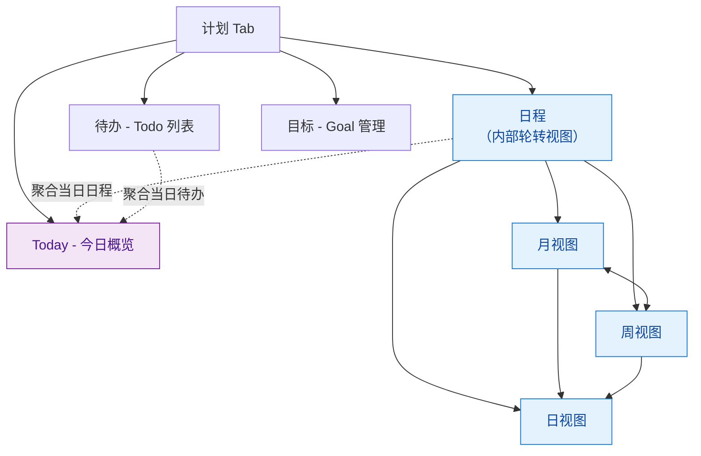
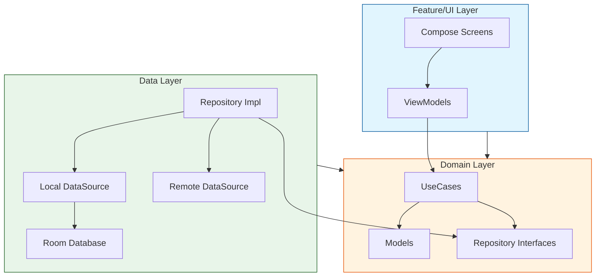
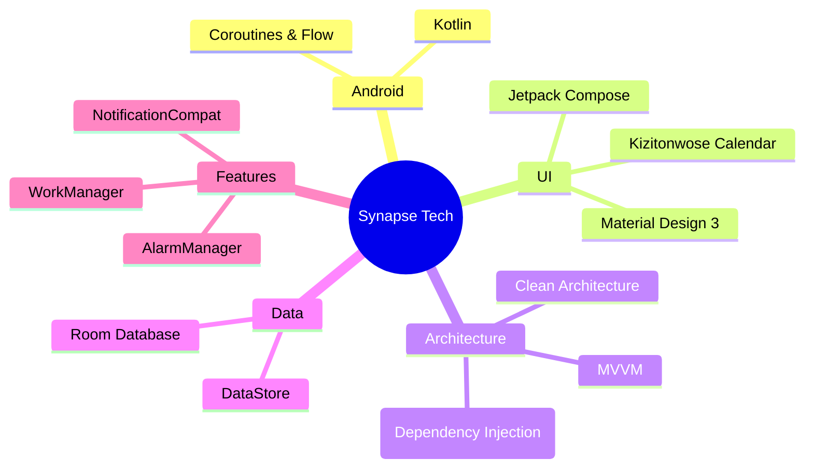
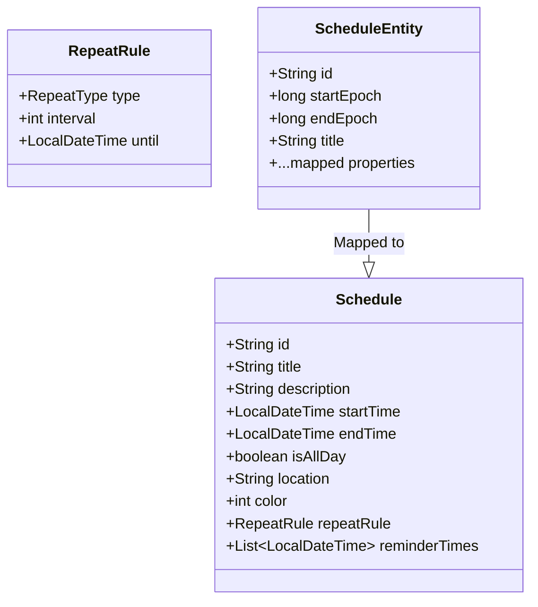
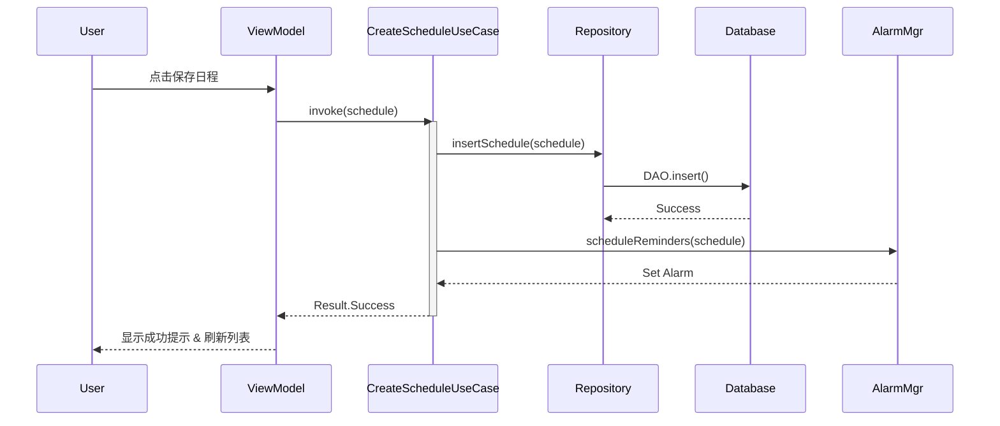

# Synapse 日历应用 你的日程管理助手 - 产品开发报告

## 前言

在快节奏的现代生活中，时间已成为最稀缺的资源。对于学生群体而言，日常不仅需要平衡课程、作业、社团与考试，还要应对频繁变动的临时安排——高效、直观且可靠的日程管理工具显得尤为关键。

然而，当前主流日历应用普遍存在两极分化：要么功能臃肿、交互复杂，学习成本高；要么过于轻量，缺乏如农历节气、多级提醒等本土化与实用性设计。更重要的是，它们大多依赖手动输入，无法理解自然语言指令，例如“下周三下午3点交高数作业”或“每天晚上8点背单词”，这与学生习惯的表达方式存在明显割裂。

为此，我们打造了 Synapse 日历——一款专为学生设计的智能日程助手。它不仅提供简洁流畅的月/周/日视图、精准保活的提醒机制和农历支持，更前瞻性地集成自然语言交互能力：用户只需用日常语言描述计划，系统即可自动解析时间、事件与重复规则，并创建结构化日程。让时间管理不再繁琐，而是像和朋友聊天一样自然、高效。

## 1. 产品功能介绍

Synapse 日历是一款基于 Android 平台的现代化日程管理应用，旨在通过简洁的界面和强大的功能帮助用户高效规划时间。目前已实现作业要求的基本功能及部分扩展功能。

### 1.1 核心功能

本项目的核心功能围绕“计划管理”展开，设计了**三大核心入口：计划 · 对话 · 用户**

#### 1.1.1 计划模块

从需求的分析，我认为：**计划** 是用户日常使用的核心场景。计划按前瞻性可分为三类：即时记录与执行（Task）、中期安排（日程 Schedule）、长期目标（Goal）。



**计划模块：从今日行动到长期愿景** “计划”Tab 作为用户日常使用的核心场景，细分为四个子视图，覆盖从即时执行到战略规划的全周期需求：

- **今日概览(Today)**  
  智能聚合当日所有日程、待办事项与目标进度，提供复盘与快速查询的一站式视图，帮助用户快速掌握当日重点，减少认知负荷。

- **日程（Schedule）**  
  支持三种时间粒度的灵活切换：
  - **月视图**：全局时间分布，支持农历日期与二十四节气显示，贴合本土习惯；
  - **周视图**：垂直时间轴布局，直观呈现每日时间占用；
  - **日视图**：分钟级精度的时间块排布，适合精细安排会议、课程等固定时段事件。  
  各视图间支持手势滑动与流畅动画过渡，交互自然连贯。  
  完整实现日程的 **CRUD（创建、读取、更新、删除）** 操作，支持标题、描述、起止时间、地点、全天事件标记及自定义颜色分类，便于视觉识别与分类管理。

相较于传统的日历应用，通过tab栏切换三视图，我采用的则是通过 Drag 操作在周与月视图之间进行切换，实现**多视图联动**，而在点击当前选择的日期时，会自动切换至对应的日视图，定位到该天的时间线。
**月视图**：

```plaintext
┌─────────────────────────────────────────┐
│  < 2025年12月 >            [+][定位当天] │
├─────┬─────┬─────┬─────┬─────┬─────┬─────┤
│  日 │ 一  │ 二  │ 三   │ 四  │ 五  │ 六  │
├─────┼─────┼─────┼─────┼─────┼─────┼─────┤
│     │  1  │  2  │  3  │  4  │  5  │  6  │
│     │初一 │     │ ●●  │     │ ●   │     │
├─────┼─────┼─────┼─────┼─────┼─────┼─────┤
│  7  │  8  │  9  │ 10  │ 11  │ 12  │ 13  │
│     │大雪 │     │     │     │     │     │
└─────┴─────┴─────┴─────┴─────┴─────┴─────┘
└────────────────drag按钮─────────────────┘
│            选中的日期的日程              │
│                                         │
└─────────────────────────────────────────┘
```

**周视图**：

```plaintext
┌────────────────────────────────────────────────┐
│  < 第49周 >                       [+][定位当天] │
├──────┬──────┬──────┬──────┬──────┬──────┬──────┤
│ 12/1 │ 12/2 │ 12/3 │ 12/4 │ 12/5 │ 12/6 │ 12/7 │ <- 月视图折叠
├──────┼──────┼──────┼──────┼──────┼──────┼──────┤
│08:00 │      │      │██████│      │      │      │
│09:00 │██████│      │██████│      │      │      │
│10:00 │██████│      │      │      │██████│      │
│...   │      │      │      │      │      │      │
└──────┴──────┴──────┴──────┴──────┴──────┴──────┘
```

- **待办（Task）**  
  轻量级任务列表，支持勾选完成、设置截止日期，并可关联日程或目标，适用于课程作业、临时事项等碎片化任务的高效追踪。

- **目标（Goal）**  
  支持设定中长期目标（如“期末GPA 3.8”或“一个月背完5000单词”），并可通过手动拆解或 **AI 辅助** 自动生成子任务与关联日程，打通“愿景 → 计划 → 执行”的完整闭环。

### 1.2 扩展功能

- **中国农历与节气支持**  
  集成开源 `Lunar` 算法库，在月视图及 Today 页面同步显示农历日期与二十四节气，深度适配中国用户的日历使用习惯。

- **日历数据导入与订阅架构（开发中）**  
  - 数据库已预置 `Subscription` 表结构，用于管理 WebCal/ICS 订阅源地址；  
  - 引入 `biweekly` 库，为后续解析 iCalendar 协议、支持 Google Calendar 等外部日历源同步奠定技术基础，未来将实现跨平台日程无缝接入。

## 2. 软件架构设计

本项目采用业界推荐的 **Clean Architecture (整洁架构)** 结合 **MVVM** 模式，确保高内聚、低耦合，易于测试和扩展。

### 2.1 架构分层图



### 2.2 技术栈概览



---

## 3. 程序概要设计

### 3.1 核心数据模型 (ER图)

日程数据模型设计兼顾了灵活性与扩展性，支持复杂的重复规则。



### 3.2 业务流程：日程创建



---

## 4. 技术亮点与实现原理

### 4.1 强力保活提醒机制 (Reliable Reminders)

针对 Android 系统严格的后台限制，本项目实现了一套高可靠的提醒方案：

- **精确闹钟 (`setAlarmClock`)**：使用最高优先级的闹钟 API，确保在 Doze (打盹) 模式下也能唤醒 CPU。
- **前台服务守护 (`ReminderGuardService`)**：在提醒触发的一段时间前启动前台服务，提升进程优先级，防止被系统杀后台，从而保证闹钟准时执行。

### 4.2 现代化的 UI/UX 体验

- **Shared Element Transitions**：在从“月视图”点击进入“日详情”时，使用了 Compose 实验性的共享元素转场，提供丝滑的视觉连续性。
- **单向数据流 (UDF)**：UI 状态严格由 ViewModel 的 `StateFlow` 驱动，因果关系清晰，极大降低了 UI 状态同步的 bug 率。

### 4.3 严格的模块隔离

- **Domain 纯净性**：`Domain` 模块仅包含纯 Kotlin 代码，不依赖 Android SDK，这使得核心业务逻辑可以脱离 Android 模拟器进行快速单元测试 (Unit Test)。
