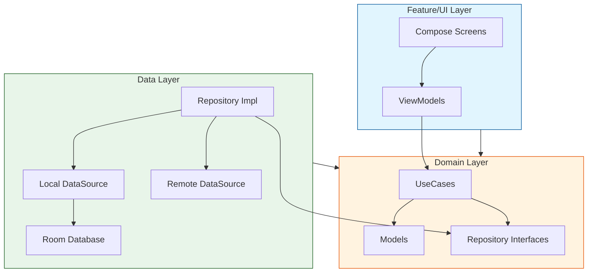
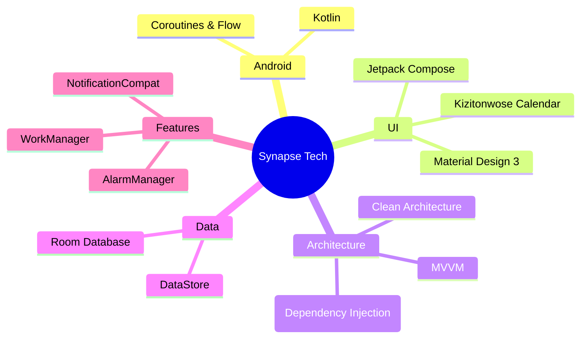
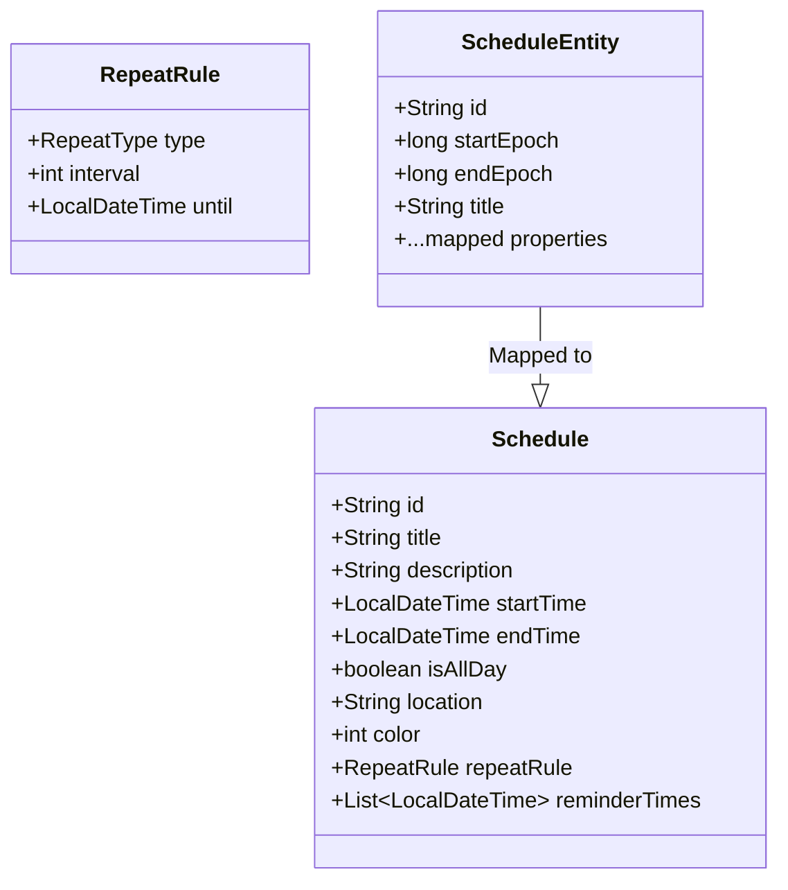
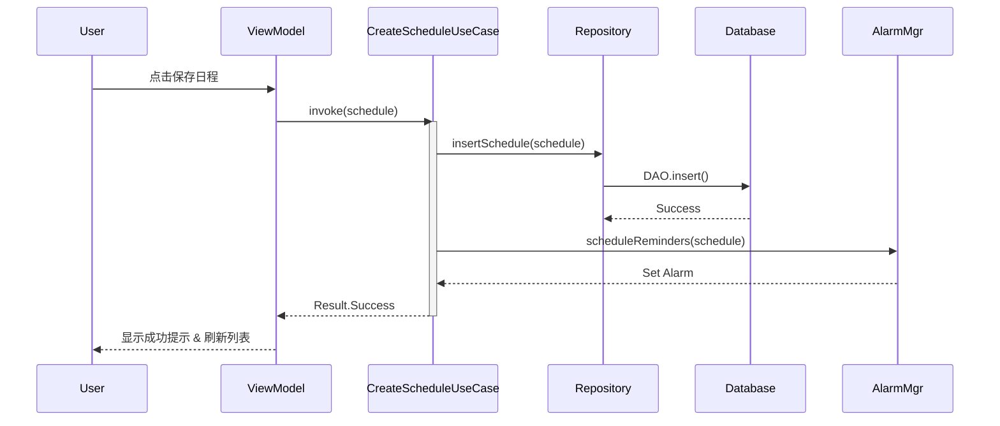

# Synapse 日历应用 - 产品开发报告

## 1. 产品功能介绍

Synapse 日历是一款基于 Android 平台的现代化日程管理应用，旨在通过简洁的界面和强大的功能帮助用户高效规划时间。目前已实现作业要求的基本功能及部分扩展功能。

### 1.1 核心功能（基本要求）

* **多维日历视图**
  * **月视图 (Month View)**：提供宏观的时间概览，支持农历日期显示。
  * **周视图 (Week View)**：垂直时间轴布局，精确展示每天的时间占用情况。
  * **日视图 (Day View)**：详细的一日行程管理，支持精确到分钟的时间块展示。
  * **平滑切换**：各视图间支持无缝手势切换与动画过渡。

* **全生命周期日程管理**
  * 支持日程的**创建 (Create)**、**查看 (Read)**、**编辑 (Update)** 和 **删除 (Delete)**。
  * 日程属性包含：标题、描述、起止时间、地点、全天事件标记等。
  * 支持为日程设置特定的**颜色标记**，便于分类管理。

* **多级智能提醒系统**
  * **普通提醒**：利用系统通知进行温和提示。
  * **强力提醒 (Alarm)**：集成 `AlarmManager` 与 `ForegroundService`，即使在应用关闭或设备休眠模式下也能确保闹钟准时响起。
  * 支持设置多个提醒时间点（如：提前10分钟、提前1小时）。

### 1.2 扩展功能

* **中国农历支持**：集成了 `Lunar` 算法库，在日历视图中显示农历日期与节气，符合中国用户使用习惯。
* **数据导入/订阅架构（开发中）**：
  * 底层数据库已设计 `Subscription` 表结构，支持存储 WebCal/ICS 订阅源地址。
  * 已引入 `biweekly` 库依赖，用于未来的 iCalendar 协议解析。

---

## 2. 软件架构设计

本项目采用业界推荐的 **Clean Architecture (整洁架构)** 结合 **MVVM** 模式，确保高内聚、低耦合，易于测试和扩展。

### 2.1 架构分层图

### 2.2 技术栈概览

---

## 3. 程序概要设计

### 3.1 核心数据模型 (ER图)

日程数据模型设计兼顾了灵活性与扩展性，支持复杂的重复规则。

### 3.2 业务流程：日程创建

---

## 4. 技术亮点与实现原理

### 4.1 强力保活提醒机制 (Reliable Reminders)

针对 Android 系统严格的后台限制，本项目实现了一套高可靠的提醒方案：

* **精确闹钟 (`setAlarmClock`)**：使用最高优先级的闹钟 API，确保在 Doze (打盹) 模式下也能唤醒 CPU。
* **前台服务守护 (`ReminderGuardService`)**：在提醒触发的一段时间前启动前台服务，提升进程优先级，防止被系统杀后台，从而保证闹钟准时执行。

### 4.2 现代化的 UI/UX 体验

* **Shared Element Transitions**：在从“月视图”点击进入“日详情”时，使用了 Compose 实验性的共享元素转场，提供丝滑的视觉连续性。
* **单向数据流 (UDF)**：UI 状态严格由 ViewModel 的 `StateFlow` 驱动，因果关系清晰，极大降低了 UI 状态同步的 bug 率。

### 4.3 严格的模块隔离

* **Domain 纯净性**：`Domain` 模块仅包含纯 Kotlin 代码，不依赖 Android SDK，这使得核心业务逻辑可以脱离 Android 模拟器进行快速单元测试 (Unit Test)。
